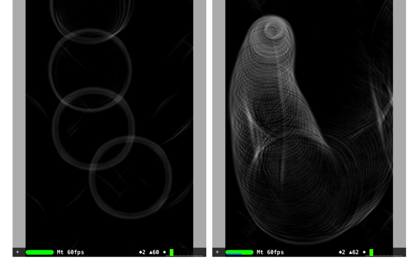

# Waves in Metal compute shaders

The algorithm is based on simple Euler integration, you can find a JavaScript implementation [here](http://users.softlab.ntua.gr/~ttsiod/wavePhysics.html).

The 'working with Metal' parts of this project owe much to FlexMonkey's [Reaction Diffusion using Swift & Metal](https://github.com/FlexMonkey/MetalReactionDiffusion).

[YouTube video of simlation](https://youtu.be/cy4S7QrLy8Y)

The black quad seen in the screenshots and video is SceneKit geometry (SCNPlane), the texture of this SCNGeometry is set to be the output texture of the Metal compute shader. SceneKit also handles the hit detection, the hit coordinates are translated into texture coordinates and drawn into the input textures (red square seen in video).

# LICENSE
MIT
